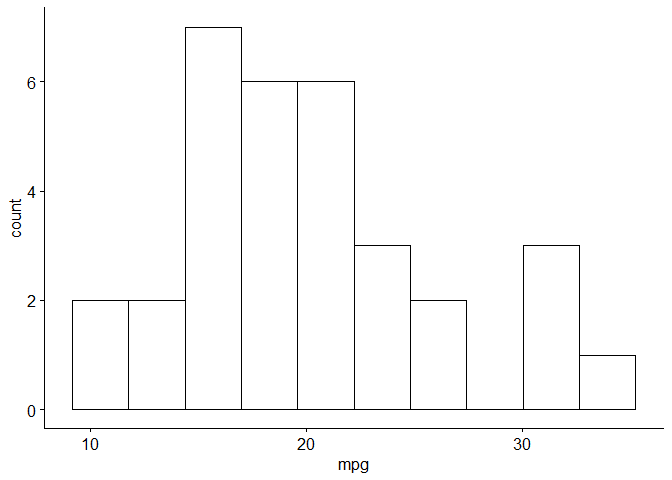
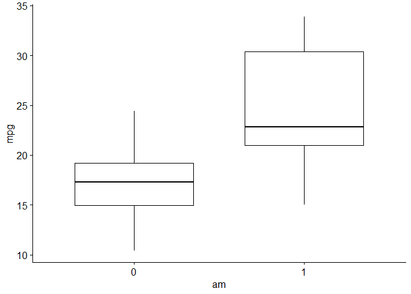
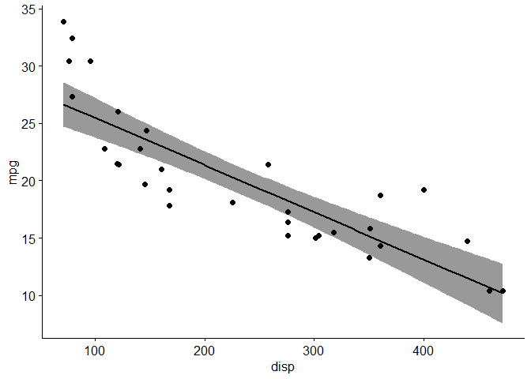

# EXPLORATORY & DESCRIPTIVE ANALYSES

## **LOAD LIBRARIES**

``` r
library(gtsummary) 
#For creating publication ready tables

library(flextable) 
```

    ## 
    ## Attaching package: 'flextable'

    ## The following objects are masked from 'package:gtsummary':
    ## 
    ##     as_flextable, continuous_summary

``` r
#Supplement to the `gtsummary` package to print the tables

library(ggpubr) 
```

    ## Loading required package: ggplot2

    ## 
    ## Attaching package: 'ggpubr'

    ## The following objects are masked from 'package:flextable':
    ## 
    ##     border, font, rotate

``` r
#For creating publication ready plots
```

## **ATTACH DATA**

``` r
df <- datasets::mtcars 
#Store the `mtcars` dataset in an object: `df`

attach(df) 
```

    ## The following object is masked from package:ggplot2:
    ## 
    ##     mpg

``` r
#Easy accessibility to variables in the dataset

View(df) 
#View the dataset

?mtcars 
```

    ## starting httpd help server ...

    ##  done

``` r
#Help function to get an overview
```

## **DESCRIPTIVE ANALYSIS**

``` r
table1 <- tbl_summary(df) 
#Store the table in an object: `table1`

table1 
```

<div id="lwygcfogzr" style="padding-left:0px;padding-right:0px;padding-top:10px;padding-bottom:10px;overflow-x:auto;overflow-y:auto;width:auto;height:auto;">
<style>#lwygcfogzr table {
  font-family: system-ui, 'Segoe UI', Roboto, Helvetica, Arial, sans-serif, 'Apple Color Emoji', 'Segoe UI Emoji', 'Segoe UI Symbol', 'Noto Color Emoji';
  -webkit-font-smoothing: antialiased;
  -moz-osx-font-smoothing: grayscale;
}
&#10;#lwygcfogzr thead, #lwygcfogzr tbody, #lwygcfogzr tfoot, #lwygcfogzr tr, #lwygcfogzr td, #lwygcfogzr th {
  border-style: none;
}
&#10;#lwygcfogzr p {
  margin: 0;
  padding: 0;
}
&#10;#lwygcfogzr .gt_table {
  display: table;
  border-collapse: collapse;
  line-height: normal;
  margin-left: auto;
  margin-right: auto;
  color: #333333;
  font-size: 16px;
  font-weight: normal;
  font-style: normal;
  background-color: #FFFFFF;
  width: auto;
  border-top-style: solid;
  border-top-width: 2px;
  border-top-color: #A8A8A8;
  border-right-style: none;
  border-right-width: 2px;
  border-right-color: #D3D3D3;
  border-bottom-style: solid;
  border-bottom-width: 2px;
  border-bottom-color: #A8A8A8;
  border-left-style: none;
  border-left-width: 2px;
  border-left-color: #D3D3D3;
}
&#10;#lwygcfogzr .gt_caption {
  padding-top: 4px;
  padding-bottom: 4px;
}
&#10;#lwygcfogzr .gt_title {
  color: #333333;
  font-size: 125%;
  font-weight: initial;
  padding-top: 4px;
  padding-bottom: 4px;
  padding-left: 5px;
  padding-right: 5px;
  border-bottom-color: #FFFFFF;
  border-bottom-width: 0;
}
&#10;#lwygcfogzr .gt_subtitle {
  color: #333333;
  font-size: 85%;
  font-weight: initial;
  padding-top: 3px;
  padding-bottom: 5px;
  padding-left: 5px;
  padding-right: 5px;
  border-top-color: #FFFFFF;
  border-top-width: 0;
}
&#10;#lwygcfogzr .gt_heading {
  background-color: #FFFFFF;
  text-align: center;
  border-bottom-color: #FFFFFF;
  border-left-style: none;
  border-left-width: 1px;
  border-left-color: #D3D3D3;
  border-right-style: none;
  border-right-width: 1px;
  border-right-color: #D3D3D3;
}
&#10;#lwygcfogzr .gt_bottom_border {
  border-bottom-style: solid;
  border-bottom-width: 2px;
  border-bottom-color: #D3D3D3;
}
&#10;#lwygcfogzr .gt_col_headings {
  border-top-style: solid;
  border-top-width: 2px;
  border-top-color: #D3D3D3;
  border-bottom-style: solid;
  border-bottom-width: 2px;
  border-bottom-color: #D3D3D3;
  border-left-style: none;
  border-left-width: 1px;
  border-left-color: #D3D3D3;
  border-right-style: none;
  border-right-width: 1px;
  border-right-color: #D3D3D3;
}
&#10;#lwygcfogzr .gt_col_heading {
  color: #333333;
  background-color: #FFFFFF;
  font-size: 100%;
  font-weight: normal;
  text-transform: inherit;
  border-left-style: none;
  border-left-width: 1px;
  border-left-color: #D3D3D3;
  border-right-style: none;
  border-right-width: 1px;
  border-right-color: #D3D3D3;
  vertical-align: bottom;
  padding-top: 5px;
  padding-bottom: 6px;
  padding-left: 5px;
  padding-right: 5px;
  overflow-x: hidden;
}
&#10;#lwygcfogzr .gt_column_spanner_outer {
  color: #333333;
  background-color: #FFFFFF;
  font-size: 100%;
  font-weight: normal;
  text-transform: inherit;
  padding-top: 0;
  padding-bottom: 0;
  padding-left: 4px;
  padding-right: 4px;
}
&#10;#lwygcfogzr .gt_column_spanner_outer:first-child {
  padding-left: 0;
}
&#10;#lwygcfogzr .gt_column_spanner_outer:last-child {
  padding-right: 0;
}
&#10;#lwygcfogzr .gt_column_spanner {
  border-bottom-style: solid;
  border-bottom-width: 2px;
  border-bottom-color: #D3D3D3;
  vertical-align: bottom;
  padding-top: 5px;
  padding-bottom: 5px;
  overflow-x: hidden;
  display: inline-block;
  width: 100%;
}
&#10;#lwygcfogzr .gt_spanner_row {
  border-bottom-style: hidden;
}
&#10;#lwygcfogzr .gt_group_heading {
  padding-top: 8px;
  padding-bottom: 8px;
  padding-left: 5px;
  padding-right: 5px;
  color: #333333;
  background-color: #FFFFFF;
  font-size: 100%;
  font-weight: initial;
  text-transform: inherit;
  border-top-style: solid;
  border-top-width: 2px;
  border-top-color: #D3D3D3;
  border-bottom-style: solid;
  border-bottom-width: 2px;
  border-bottom-color: #D3D3D3;
  border-left-style: none;
  border-left-width: 1px;
  border-left-color: #D3D3D3;
  border-right-style: none;
  border-right-width: 1px;
  border-right-color: #D3D3D3;
  vertical-align: middle;
  text-align: left;
}
&#10;#lwygcfogzr .gt_empty_group_heading {
  padding: 0.5px;
  color: #333333;
  background-color: #FFFFFF;
  font-size: 100%;
  font-weight: initial;
  border-top-style: solid;
  border-top-width: 2px;
  border-top-color: #D3D3D3;
  border-bottom-style: solid;
  border-bottom-width: 2px;
  border-bottom-color: #D3D3D3;
  vertical-align: middle;
}
&#10;#lwygcfogzr .gt_from_md > :first-child {
  margin-top: 0;
}
&#10;#lwygcfogzr .gt_from_md > :last-child {
  margin-bottom: 0;
}
&#10;#lwygcfogzr .gt_row {
  padding-top: 8px;
  padding-bottom: 8px;
  padding-left: 5px;
  padding-right: 5px;
  margin: 10px;
  border-top-style: solid;
  border-top-width: 1px;
  border-top-color: #D3D3D3;
  border-left-style: none;
  border-left-width: 1px;
  border-left-color: #D3D3D3;
  border-right-style: none;
  border-right-width: 1px;
  border-right-color: #D3D3D3;
  vertical-align: middle;
  overflow-x: hidden;
}
&#10;#lwygcfogzr .gt_stub {
  color: #333333;
  background-color: #FFFFFF;
  font-size: 100%;
  font-weight: initial;
  text-transform: inherit;
  border-right-style: solid;
  border-right-width: 2px;
  border-right-color: #D3D3D3;
  padding-left: 5px;
  padding-right: 5px;
}
&#10;#lwygcfogzr .gt_stub_row_group {
  color: #333333;
  background-color: #FFFFFF;
  font-size: 100%;
  font-weight: initial;
  text-transform: inherit;
  border-right-style: solid;
  border-right-width: 2px;
  border-right-color: #D3D3D3;
  padding-left: 5px;
  padding-right: 5px;
  vertical-align: top;
}
&#10;#lwygcfogzr .gt_row_group_first td {
  border-top-width: 2px;
}
&#10;#lwygcfogzr .gt_row_group_first th {
  border-top-width: 2px;
}
&#10;#lwygcfogzr .gt_summary_row {
  color: #333333;
  background-color: #FFFFFF;
  text-transform: inherit;
  padding-top: 8px;
  padding-bottom: 8px;
  padding-left: 5px;
  padding-right: 5px;
}
&#10;#lwygcfogzr .gt_first_summary_row {
  border-top-style: solid;
  border-top-color: #D3D3D3;
}
&#10;#lwygcfogzr .gt_first_summary_row.thick {
  border-top-width: 2px;
}
&#10;#lwygcfogzr .gt_last_summary_row {
  padding-top: 8px;
  padding-bottom: 8px;
  padding-left: 5px;
  padding-right: 5px;
  border-bottom-style: solid;
  border-bottom-width: 2px;
  border-bottom-color: #D3D3D3;
}
&#10;#lwygcfogzr .gt_grand_summary_row {
  color: #333333;
  background-color: #FFFFFF;
  text-transform: inherit;
  padding-top: 8px;
  padding-bottom: 8px;
  padding-left: 5px;
  padding-right: 5px;
}
&#10;#lwygcfogzr .gt_first_grand_summary_row {
  padding-top: 8px;
  padding-bottom: 8px;
  padding-left: 5px;
  padding-right: 5px;
  border-top-style: double;
  border-top-width: 6px;
  border-top-color: #D3D3D3;
}
&#10;#lwygcfogzr .gt_last_grand_summary_row_top {
  padding-top: 8px;
  padding-bottom: 8px;
  padding-left: 5px;
  padding-right: 5px;
  border-bottom-style: double;
  border-bottom-width: 6px;
  border-bottom-color: #D3D3D3;
}
&#10;#lwygcfogzr .gt_striped {
  background-color: rgba(128, 128, 128, 0.05);
}
&#10;#lwygcfogzr .gt_table_body {
  border-top-style: solid;
  border-top-width: 2px;
  border-top-color: #D3D3D3;
  border-bottom-style: solid;
  border-bottom-width: 2px;
  border-bottom-color: #D3D3D3;
}
&#10;#lwygcfogzr .gt_footnotes {
  color: #333333;
  background-color: #FFFFFF;
  border-bottom-style: none;
  border-bottom-width: 2px;
  border-bottom-color: #D3D3D3;
  border-left-style: none;
  border-left-width: 2px;
  border-left-color: #D3D3D3;
  border-right-style: none;
  border-right-width: 2px;
  border-right-color: #D3D3D3;
}
&#10;#lwygcfogzr .gt_footnote {
  margin: 0px;
  font-size: 90%;
  padding-top: 4px;
  padding-bottom: 4px;
  padding-left: 5px;
  padding-right: 5px;
}
&#10;#lwygcfogzr .gt_sourcenotes {
  color: #333333;
  background-color: #FFFFFF;
  border-bottom-style: none;
  border-bottom-width: 2px;
  border-bottom-color: #D3D3D3;
  border-left-style: none;
  border-left-width: 2px;
  border-left-color: #D3D3D3;
  border-right-style: none;
  border-right-width: 2px;
  border-right-color: #D3D3D3;
}
&#10;#lwygcfogzr .gt_sourcenote {
  font-size: 90%;
  padding-top: 4px;
  padding-bottom: 4px;
  padding-left: 5px;
  padding-right: 5px;
}
&#10;#lwygcfogzr .gt_left {
  text-align: left;
}
&#10;#lwygcfogzr .gt_center {
  text-align: center;
}
&#10;#lwygcfogzr .gt_right {
  text-align: right;
  font-variant-numeric: tabular-nums;
}
&#10;#lwygcfogzr .gt_font_normal {
  font-weight: normal;
}
&#10;#lwygcfogzr .gt_font_bold {
  font-weight: bold;
}
&#10;#lwygcfogzr .gt_font_italic {
  font-style: italic;
}
&#10;#lwygcfogzr .gt_super {
  font-size: 65%;
}
&#10;#lwygcfogzr .gt_footnote_marks {
  font-size: 75%;
  vertical-align: 0.4em;
  position: initial;
}
&#10;#lwygcfogzr .gt_asterisk {
  font-size: 100%;
  vertical-align: 0;
}
&#10;#lwygcfogzr .gt_indent_1 {
  text-indent: 5px;
}
&#10;#lwygcfogzr .gt_indent_2 {
  text-indent: 10px;
}
&#10;#lwygcfogzr .gt_indent_3 {
  text-indent: 15px;
}
&#10;#lwygcfogzr .gt_indent_4 {
  text-indent: 20px;
}
&#10;#lwygcfogzr .gt_indent_5 {
  text-indent: 25px;
}
</style>
<table class="gt_table" data-quarto-disable-processing="false" data-quarto-bootstrap="false">
  <thead>
    &#10;    <tr class="gt_col_headings">
      <th class="gt_col_heading gt_columns_bottom_border gt_left" rowspan="1" colspan="1" scope="col" id="&lt;strong&gt;Characteristic&lt;/strong&gt;"><strong>Characteristic</strong></th>
      <th class="gt_col_heading gt_columns_bottom_border gt_center" rowspan="1" colspan="1" scope="col" id="&lt;strong&gt;N = 32&lt;/strong&gt;&lt;span class=&quot;gt_footnote_marks&quot; style=&quot;white-space:nowrap;font-style:italic;font-weight:normal;&quot;&gt;&lt;sup&gt;1&lt;/sup&gt;&lt;/span&gt;"><strong>N = 32</strong><span class="gt_footnote_marks" style="white-space:nowrap;font-style:italic;font-weight:normal;"><sup>1</sup></span></th>
    </tr>
  </thead>
  <tbody class="gt_table_body">
    <tr><td headers="label" class="gt_row gt_left">mpg</td>
<td headers="stat_0" class="gt_row gt_center">19.2 (15.4, 22.8)</td></tr>
    <tr><td headers="label" class="gt_row gt_left">cyl</td>
<td headers="stat_0" class="gt_row gt_center"></td></tr>
    <tr><td headers="label" class="gt_row gt_left">    4</td>
<td headers="stat_0" class="gt_row gt_center">11 (34%)</td></tr>
    <tr><td headers="label" class="gt_row gt_left">    6</td>
<td headers="stat_0" class="gt_row gt_center">7 (22%)</td></tr>
    <tr><td headers="label" class="gt_row gt_left">    8</td>
<td headers="stat_0" class="gt_row gt_center">14 (44%)</td></tr>
    <tr><td headers="label" class="gt_row gt_left">disp</td>
<td headers="stat_0" class="gt_row gt_center">196 (121, 326)</td></tr>
    <tr><td headers="label" class="gt_row gt_left">hp</td>
<td headers="stat_0" class="gt_row gt_center">123 (97, 180)</td></tr>
    <tr><td headers="label" class="gt_row gt_left">drat</td>
<td headers="stat_0" class="gt_row gt_center">3.70 (3.08, 3.92)</td></tr>
    <tr><td headers="label" class="gt_row gt_left">wt</td>
<td headers="stat_0" class="gt_row gt_center">3.33 (2.58, 3.61)</td></tr>
    <tr><td headers="label" class="gt_row gt_left">qsec</td>
<td headers="stat_0" class="gt_row gt_center">17.71 (16.89, 18.90)</td></tr>
    <tr><td headers="label" class="gt_row gt_left">vs</td>
<td headers="stat_0" class="gt_row gt_center">14 (44%)</td></tr>
    <tr><td headers="label" class="gt_row gt_left">am</td>
<td headers="stat_0" class="gt_row gt_center">13 (41%)</td></tr>
    <tr><td headers="label" class="gt_row gt_left">gear</td>
<td headers="stat_0" class="gt_row gt_center"></td></tr>
    <tr><td headers="label" class="gt_row gt_left">    3</td>
<td headers="stat_0" class="gt_row gt_center">15 (47%)</td></tr>
    <tr><td headers="label" class="gt_row gt_left">    4</td>
<td headers="stat_0" class="gt_row gt_center">12 (38%)</td></tr>
    <tr><td headers="label" class="gt_row gt_left">    5</td>
<td headers="stat_0" class="gt_row gt_center">5 (16%)</td></tr>
    <tr><td headers="label" class="gt_row gt_left">carb</td>
<td headers="stat_0" class="gt_row gt_center"></td></tr>
    <tr><td headers="label" class="gt_row gt_left">    1</td>
<td headers="stat_0" class="gt_row gt_center">7 (22%)</td></tr>
    <tr><td headers="label" class="gt_row gt_left">    2</td>
<td headers="stat_0" class="gt_row gt_center">10 (31%)</td></tr>
    <tr><td headers="label" class="gt_row gt_left">    3</td>
<td headers="stat_0" class="gt_row gt_center">3 (9.4%)</td></tr>
    <tr><td headers="label" class="gt_row gt_left">    4</td>
<td headers="stat_0" class="gt_row gt_center">10 (31%)</td></tr>
    <tr><td headers="label" class="gt_row gt_left">    6</td>
<td headers="stat_0" class="gt_row gt_center">1 (3.1%)</td></tr>
    <tr><td headers="label" class="gt_row gt_left">    8</td>
<td headers="stat_0" class="gt_row gt_center">1 (3.1%)</td></tr>
  </tbody>
  &#10;  <tfoot class="gt_footnotes">
    <tr>
      <td class="gt_footnote" colspan="2"><span class="gt_footnote_marks" style="white-space:nowrap;font-style:italic;font-weight:normal;"><sup>1</sup></span> Median (IQR); n (%)</td>
    </tr>
  </tfoot>
</table>
</div>

``` r
#Call the table

table2 <- tbl_summary(df, by = "am") 
#Group the table on factor `am`

table2 
```

<div id="quyelwupik" style="padding-left:0px;padding-right:0px;padding-top:10px;padding-bottom:10px;overflow-x:auto;overflow-y:auto;width:auto;height:auto;">
<style>#quyelwupik table {
  font-family: system-ui, 'Segoe UI', Roboto, Helvetica, Arial, sans-serif, 'Apple Color Emoji', 'Segoe UI Emoji', 'Segoe UI Symbol', 'Noto Color Emoji';
  -webkit-font-smoothing: antialiased;
  -moz-osx-font-smoothing: grayscale;
}
&#10;#quyelwupik thead, #quyelwupik tbody, #quyelwupik tfoot, #quyelwupik tr, #quyelwupik td, #quyelwupik th {
  border-style: none;
}
&#10;#quyelwupik p {
  margin: 0;
  padding: 0;
}
&#10;#quyelwupik .gt_table {
  display: table;
  border-collapse: collapse;
  line-height: normal;
  margin-left: auto;
  margin-right: auto;
  color: #333333;
  font-size: 16px;
  font-weight: normal;
  font-style: normal;
  background-color: #FFFFFF;
  width: auto;
  border-top-style: solid;
  border-top-width: 2px;
  border-top-color: #A8A8A8;
  border-right-style: none;
  border-right-width: 2px;
  border-right-color: #D3D3D3;
  border-bottom-style: solid;
  border-bottom-width: 2px;
  border-bottom-color: #A8A8A8;
  border-left-style: none;
  border-left-width: 2px;
  border-left-color: #D3D3D3;
}
&#10;#quyelwupik .gt_caption {
  padding-top: 4px;
  padding-bottom: 4px;
}
&#10;#quyelwupik .gt_title {
  color: #333333;
  font-size: 125%;
  font-weight: initial;
  padding-top: 4px;
  padding-bottom: 4px;
  padding-left: 5px;
  padding-right: 5px;
  border-bottom-color: #FFFFFF;
  border-bottom-width: 0;
}
&#10;#quyelwupik .gt_subtitle {
  color: #333333;
  font-size: 85%;
  font-weight: initial;
  padding-top: 3px;
  padding-bottom: 5px;
  padding-left: 5px;
  padding-right: 5px;
  border-top-color: #FFFFFF;
  border-top-width: 0;
}
&#10;#quyelwupik .gt_heading {
  background-color: #FFFFFF;
  text-align: center;
  border-bottom-color: #FFFFFF;
  border-left-style: none;
  border-left-width: 1px;
  border-left-color: #D3D3D3;
  border-right-style: none;
  border-right-width: 1px;
  border-right-color: #D3D3D3;
}
&#10;#quyelwupik .gt_bottom_border {
  border-bottom-style: solid;
  border-bottom-width: 2px;
  border-bottom-color: #D3D3D3;
}
&#10;#quyelwupik .gt_col_headings {
  border-top-style: solid;
  border-top-width: 2px;
  border-top-color: #D3D3D3;
  border-bottom-style: solid;
  border-bottom-width: 2px;
  border-bottom-color: #D3D3D3;
  border-left-style: none;
  border-left-width: 1px;
  border-left-color: #D3D3D3;
  border-right-style: none;
  border-right-width: 1px;
  border-right-color: #D3D3D3;
}
&#10;#quyelwupik .gt_col_heading {
  color: #333333;
  background-color: #FFFFFF;
  font-size: 100%;
  font-weight: normal;
  text-transform: inherit;
  border-left-style: none;
  border-left-width: 1px;
  border-left-color: #D3D3D3;
  border-right-style: none;
  border-right-width: 1px;
  border-right-color: #D3D3D3;
  vertical-align: bottom;
  padding-top: 5px;
  padding-bottom: 6px;
  padding-left: 5px;
  padding-right: 5px;
  overflow-x: hidden;
}
&#10;#quyelwupik .gt_column_spanner_outer {
  color: #333333;
  background-color: #FFFFFF;
  font-size: 100%;
  font-weight: normal;
  text-transform: inherit;
  padding-top: 0;
  padding-bottom: 0;
  padding-left: 4px;
  padding-right: 4px;
}
&#10;#quyelwupik .gt_column_spanner_outer:first-child {
  padding-left: 0;
}
&#10;#quyelwupik .gt_column_spanner_outer:last-child {
  padding-right: 0;
}
&#10;#quyelwupik .gt_column_spanner {
  border-bottom-style: solid;
  border-bottom-width: 2px;
  border-bottom-color: #D3D3D3;
  vertical-align: bottom;
  padding-top: 5px;
  padding-bottom: 5px;
  overflow-x: hidden;
  display: inline-block;
  width: 100%;
}
&#10;#quyelwupik .gt_spanner_row {
  border-bottom-style: hidden;
}
&#10;#quyelwupik .gt_group_heading {
  padding-top: 8px;
  padding-bottom: 8px;
  padding-left: 5px;
  padding-right: 5px;
  color: #333333;
  background-color: #FFFFFF;
  font-size: 100%;
  font-weight: initial;
  text-transform: inherit;
  border-top-style: solid;
  border-top-width: 2px;
  border-top-color: #D3D3D3;
  border-bottom-style: solid;
  border-bottom-width: 2px;
  border-bottom-color: #D3D3D3;
  border-left-style: none;
  border-left-width: 1px;
  border-left-color: #D3D3D3;
  border-right-style: none;
  border-right-width: 1px;
  border-right-color: #D3D3D3;
  vertical-align: middle;
  text-align: left;
}
&#10;#quyelwupik .gt_empty_group_heading {
  padding: 0.5px;
  color: #333333;
  background-color: #FFFFFF;
  font-size: 100%;
  font-weight: initial;
  border-top-style: solid;
  border-top-width: 2px;
  border-top-color: #D3D3D3;
  border-bottom-style: solid;
  border-bottom-width: 2px;
  border-bottom-color: #D3D3D3;
  vertical-align: middle;
}
&#10;#quyelwupik .gt_from_md > :first-child {
  margin-top: 0;
}
&#10;#quyelwupik .gt_from_md > :last-child {
  margin-bottom: 0;
}
&#10;#quyelwupik .gt_row {
  padding-top: 8px;
  padding-bottom: 8px;
  padding-left: 5px;
  padding-right: 5px;
  margin: 10px;
  border-top-style: solid;
  border-top-width: 1px;
  border-top-color: #D3D3D3;
  border-left-style: none;
  border-left-width: 1px;
  border-left-color: #D3D3D3;
  border-right-style: none;
  border-right-width: 1px;
  border-right-color: #D3D3D3;
  vertical-align: middle;
  overflow-x: hidden;
}
&#10;#quyelwupik .gt_stub {
  color: #333333;
  background-color: #FFFFFF;
  font-size: 100%;
  font-weight: initial;
  text-transform: inherit;
  border-right-style: solid;
  border-right-width: 2px;
  border-right-color: #D3D3D3;
  padding-left: 5px;
  padding-right: 5px;
}
&#10;#quyelwupik .gt_stub_row_group {
  color: #333333;
  background-color: #FFFFFF;
  font-size: 100%;
  font-weight: initial;
  text-transform: inherit;
  border-right-style: solid;
  border-right-width: 2px;
  border-right-color: #D3D3D3;
  padding-left: 5px;
  padding-right: 5px;
  vertical-align: top;
}
&#10;#quyelwupik .gt_row_group_first td {
  border-top-width: 2px;
}
&#10;#quyelwupik .gt_row_group_first th {
  border-top-width: 2px;
}
&#10;#quyelwupik .gt_summary_row {
  color: #333333;
  background-color: #FFFFFF;
  text-transform: inherit;
  padding-top: 8px;
  padding-bottom: 8px;
  padding-left: 5px;
  padding-right: 5px;
}
&#10;#quyelwupik .gt_first_summary_row {
  border-top-style: solid;
  border-top-color: #D3D3D3;
}
&#10;#quyelwupik .gt_first_summary_row.thick {
  border-top-width: 2px;
}
&#10;#quyelwupik .gt_last_summary_row {
  padding-top: 8px;
  padding-bottom: 8px;
  padding-left: 5px;
  padding-right: 5px;
  border-bottom-style: solid;
  border-bottom-width: 2px;
  border-bottom-color: #D3D3D3;
}
&#10;#quyelwupik .gt_grand_summary_row {
  color: #333333;
  background-color: #FFFFFF;
  text-transform: inherit;
  padding-top: 8px;
  padding-bottom: 8px;
  padding-left: 5px;
  padding-right: 5px;
}
&#10;#quyelwupik .gt_first_grand_summary_row {
  padding-top: 8px;
  padding-bottom: 8px;
  padding-left: 5px;
  padding-right: 5px;
  border-top-style: double;
  border-top-width: 6px;
  border-top-color: #D3D3D3;
}
&#10;#quyelwupik .gt_last_grand_summary_row_top {
  padding-top: 8px;
  padding-bottom: 8px;
  padding-left: 5px;
  padding-right: 5px;
  border-bottom-style: double;
  border-bottom-width: 6px;
  border-bottom-color: #D3D3D3;
}
&#10;#quyelwupik .gt_striped {
  background-color: rgba(128, 128, 128, 0.05);
}
&#10;#quyelwupik .gt_table_body {
  border-top-style: solid;
  border-top-width: 2px;
  border-top-color: #D3D3D3;
  border-bottom-style: solid;
  border-bottom-width: 2px;
  border-bottom-color: #D3D3D3;
}
&#10;#quyelwupik .gt_footnotes {
  color: #333333;
  background-color: #FFFFFF;
  border-bottom-style: none;
  border-bottom-width: 2px;
  border-bottom-color: #D3D3D3;
  border-left-style: none;
  border-left-width: 2px;
  border-left-color: #D3D3D3;
  border-right-style: none;
  border-right-width: 2px;
  border-right-color: #D3D3D3;
}
&#10;#quyelwupik .gt_footnote {
  margin: 0px;
  font-size: 90%;
  padding-top: 4px;
  padding-bottom: 4px;
  padding-left: 5px;
  padding-right: 5px;
}
&#10;#quyelwupik .gt_sourcenotes {
  color: #333333;
  background-color: #FFFFFF;
  border-bottom-style: none;
  border-bottom-width: 2px;
  border-bottom-color: #D3D3D3;
  border-left-style: none;
  border-left-width: 2px;
  border-left-color: #D3D3D3;
  border-right-style: none;
  border-right-width: 2px;
  border-right-color: #D3D3D3;
}
&#10;#quyelwupik .gt_sourcenote {
  font-size: 90%;
  padding-top: 4px;
  padding-bottom: 4px;
  padding-left: 5px;
  padding-right: 5px;
}
&#10;#quyelwupik .gt_left {
  text-align: left;
}
&#10;#quyelwupik .gt_center {
  text-align: center;
}
&#10;#quyelwupik .gt_right {
  text-align: right;
  font-variant-numeric: tabular-nums;
}
&#10;#quyelwupik .gt_font_normal {
  font-weight: normal;
}
&#10;#quyelwupik .gt_font_bold {
  font-weight: bold;
}
&#10;#quyelwupik .gt_font_italic {
  font-style: italic;
}
&#10;#quyelwupik .gt_super {
  font-size: 65%;
}
&#10;#quyelwupik .gt_footnote_marks {
  font-size: 75%;
  vertical-align: 0.4em;
  position: initial;
}
&#10;#quyelwupik .gt_asterisk {
  font-size: 100%;
  vertical-align: 0;
}
&#10;#quyelwupik .gt_indent_1 {
  text-indent: 5px;
}
&#10;#quyelwupik .gt_indent_2 {
  text-indent: 10px;
}
&#10;#quyelwupik .gt_indent_3 {
  text-indent: 15px;
}
&#10;#quyelwupik .gt_indent_4 {
  text-indent: 20px;
}
&#10;#quyelwupik .gt_indent_5 {
  text-indent: 25px;
}
</style>
<table class="gt_table" data-quarto-disable-processing="false" data-quarto-bootstrap="false">
  <thead>
    &#10;    <tr class="gt_col_headings">
      <th class="gt_col_heading gt_columns_bottom_border gt_left" rowspan="1" colspan="1" scope="col" id="&lt;strong&gt;Characteristic&lt;/strong&gt;"><strong>Characteristic</strong></th>
      <th class="gt_col_heading gt_columns_bottom_border gt_center" rowspan="1" colspan="1" scope="col" id="&lt;strong&gt;0&lt;/strong&gt;, N = 19&lt;span class=&quot;gt_footnote_marks&quot; style=&quot;white-space:nowrap;font-style:italic;font-weight:normal;&quot;&gt;&lt;sup&gt;1&lt;/sup&gt;&lt;/span&gt;"><strong>0</strong>, N = 19<span class="gt_footnote_marks" style="white-space:nowrap;font-style:italic;font-weight:normal;"><sup>1</sup></span></th>
      <th class="gt_col_heading gt_columns_bottom_border gt_center" rowspan="1" colspan="1" scope="col" id="&lt;strong&gt;1&lt;/strong&gt;, N = 13&lt;span class=&quot;gt_footnote_marks&quot; style=&quot;white-space:nowrap;font-style:italic;font-weight:normal;&quot;&gt;&lt;sup&gt;1&lt;/sup&gt;&lt;/span&gt;"><strong>1</strong>, N = 13<span class="gt_footnote_marks" style="white-space:nowrap;font-style:italic;font-weight:normal;"><sup>1</sup></span></th>
    </tr>
  </thead>
  <tbody class="gt_table_body">
    <tr><td headers="label" class="gt_row gt_left">mpg</td>
<td headers="stat_1" class="gt_row gt_center">17.3 (15.0, 19.2)</td>
<td headers="stat_2" class="gt_row gt_center">22.8 (21.0, 30.4)</td></tr>
    <tr><td headers="label" class="gt_row gt_left">cyl</td>
<td headers="stat_1" class="gt_row gt_center"></td>
<td headers="stat_2" class="gt_row gt_center"></td></tr>
    <tr><td headers="label" class="gt_row gt_left">    4</td>
<td headers="stat_1" class="gt_row gt_center">3 (16%)</td>
<td headers="stat_2" class="gt_row gt_center">8 (62%)</td></tr>
    <tr><td headers="label" class="gt_row gt_left">    6</td>
<td headers="stat_1" class="gt_row gt_center">4 (21%)</td>
<td headers="stat_2" class="gt_row gt_center">3 (23%)</td></tr>
    <tr><td headers="label" class="gt_row gt_left">    8</td>
<td headers="stat_1" class="gt_row gt_center">12 (63%)</td>
<td headers="stat_2" class="gt_row gt_center">2 (15%)</td></tr>
    <tr><td headers="label" class="gt_row gt_left">disp</td>
<td headers="stat_1" class="gt_row gt_center">276 (196, 360)</td>
<td headers="stat_2" class="gt_row gt_center">120 (79, 160)</td></tr>
    <tr><td headers="label" class="gt_row gt_left">hp</td>
<td headers="stat_1" class="gt_row gt_center">175 (117, 193)</td>
<td headers="stat_2" class="gt_row gt_center">109 (66, 113)</td></tr>
    <tr><td headers="label" class="gt_row gt_left">drat</td>
<td headers="stat_1" class="gt_row gt_center">3.15 (3.07, 3.70)</td>
<td headers="stat_2" class="gt_row gt_center">4.08 (3.85, 4.22)</td></tr>
    <tr><td headers="label" class="gt_row gt_left">wt</td>
<td headers="stat_1" class="gt_row gt_center">3.52 (3.44, 3.84)</td>
<td headers="stat_2" class="gt_row gt_center">2.32 (1.94, 2.78)</td></tr>
    <tr><td headers="label" class="gt_row gt_left">qsec</td>
<td headers="stat_1" class="gt_row gt_center">17.82 (17.18, 19.17)</td>
<td headers="stat_2" class="gt_row gt_center">17.02 (16.46, 18.61)</td></tr>
    <tr><td headers="label" class="gt_row gt_left">vs</td>
<td headers="stat_1" class="gt_row gt_center">7 (37%)</td>
<td headers="stat_2" class="gt_row gt_center">7 (54%)</td></tr>
    <tr><td headers="label" class="gt_row gt_left">gear</td>
<td headers="stat_1" class="gt_row gt_center"></td>
<td headers="stat_2" class="gt_row gt_center"></td></tr>
    <tr><td headers="label" class="gt_row gt_left">    3</td>
<td headers="stat_1" class="gt_row gt_center">15 (79%)</td>
<td headers="stat_2" class="gt_row gt_center">0 (0%)</td></tr>
    <tr><td headers="label" class="gt_row gt_left">    4</td>
<td headers="stat_1" class="gt_row gt_center">4 (21%)</td>
<td headers="stat_2" class="gt_row gt_center">8 (62%)</td></tr>
    <tr><td headers="label" class="gt_row gt_left">    5</td>
<td headers="stat_1" class="gt_row gt_center">0 (0%)</td>
<td headers="stat_2" class="gt_row gt_center">5 (38%)</td></tr>
    <tr><td headers="label" class="gt_row gt_left">carb</td>
<td headers="stat_1" class="gt_row gt_center"></td>
<td headers="stat_2" class="gt_row gt_center"></td></tr>
    <tr><td headers="label" class="gt_row gt_left">    1</td>
<td headers="stat_1" class="gt_row gt_center">3 (16%)</td>
<td headers="stat_2" class="gt_row gt_center">4 (31%)</td></tr>
    <tr><td headers="label" class="gt_row gt_left">    2</td>
<td headers="stat_1" class="gt_row gt_center">6 (32%)</td>
<td headers="stat_2" class="gt_row gt_center">4 (31%)</td></tr>
    <tr><td headers="label" class="gt_row gt_left">    3</td>
<td headers="stat_1" class="gt_row gt_center">3 (16%)</td>
<td headers="stat_2" class="gt_row gt_center">0 (0%)</td></tr>
    <tr><td headers="label" class="gt_row gt_left">    4</td>
<td headers="stat_1" class="gt_row gt_center">7 (37%)</td>
<td headers="stat_2" class="gt_row gt_center">3 (23%)</td></tr>
    <tr><td headers="label" class="gt_row gt_left">    6</td>
<td headers="stat_1" class="gt_row gt_center">0 (0%)</td>
<td headers="stat_2" class="gt_row gt_center">1 (7.7%)</td></tr>
    <tr><td headers="label" class="gt_row gt_left">    8</td>
<td headers="stat_1" class="gt_row gt_center">0 (0%)</td>
<td headers="stat_2" class="gt_row gt_center">1 (7.7%)</td></tr>
  </tbody>
  &#10;  <tfoot class="gt_footnotes">
    <tr>
      <td class="gt_footnote" colspan="3"><span class="gt_footnote_marks" style="white-space:nowrap;font-style:italic;font-weight:normal;"><sup>1</sup></span> Median (IQR); n (%)</td>
    </tr>
  </tfoot>
</table>
</div>

``` r
#Call the table

table3 <- tbl_summary(df, by = "am", 
                      statistic = list(all_continuous() ~ 
                                         "{mean} ({sd})"))
#Get means and standard deviations for continuous variables

table3
```

<div id="qejnnreuis" style="padding-left:0px;padding-right:0px;padding-top:10px;padding-bottom:10px;overflow-x:auto;overflow-y:auto;width:auto;height:auto;">
<style>#qejnnreuis table {
  font-family: system-ui, 'Segoe UI', Roboto, Helvetica, Arial, sans-serif, 'Apple Color Emoji', 'Segoe UI Emoji', 'Segoe UI Symbol', 'Noto Color Emoji';
  -webkit-font-smoothing: antialiased;
  -moz-osx-font-smoothing: grayscale;
}
&#10;#qejnnreuis thead, #qejnnreuis tbody, #qejnnreuis tfoot, #qejnnreuis tr, #qejnnreuis td, #qejnnreuis th {
  border-style: none;
}
&#10;#qejnnreuis p {
  margin: 0;
  padding: 0;
}
&#10;#qejnnreuis .gt_table {
  display: table;
  border-collapse: collapse;
  line-height: normal;
  margin-left: auto;
  margin-right: auto;
  color: #333333;
  font-size: 16px;
  font-weight: normal;
  font-style: normal;
  background-color: #FFFFFF;
  width: auto;
  border-top-style: solid;
  border-top-width: 2px;
  border-top-color: #A8A8A8;
  border-right-style: none;
  border-right-width: 2px;
  border-right-color: #D3D3D3;
  border-bottom-style: solid;
  border-bottom-width: 2px;
  border-bottom-color: #A8A8A8;
  border-left-style: none;
  border-left-width: 2px;
  border-left-color: #D3D3D3;
}
&#10;#qejnnreuis .gt_caption {
  padding-top: 4px;
  padding-bottom: 4px;
}
&#10;#qejnnreuis .gt_title {
  color: #333333;
  font-size: 125%;
  font-weight: initial;
  padding-top: 4px;
  padding-bottom: 4px;
  padding-left: 5px;
  padding-right: 5px;
  border-bottom-color: #FFFFFF;
  border-bottom-width: 0;
}
&#10;#qejnnreuis .gt_subtitle {
  color: #333333;
  font-size: 85%;
  font-weight: initial;
  padding-top: 3px;
  padding-bottom: 5px;
  padding-left: 5px;
  padding-right: 5px;
  border-top-color: #FFFFFF;
  border-top-width: 0;
}
&#10;#qejnnreuis .gt_heading {
  background-color: #FFFFFF;
  text-align: center;
  border-bottom-color: #FFFFFF;
  border-left-style: none;
  border-left-width: 1px;
  border-left-color: #D3D3D3;
  border-right-style: none;
  border-right-width: 1px;
  border-right-color: #D3D3D3;
}
&#10;#qejnnreuis .gt_bottom_border {
  border-bottom-style: solid;
  border-bottom-width: 2px;
  border-bottom-color: #D3D3D3;
}
&#10;#qejnnreuis .gt_col_headings {
  border-top-style: solid;
  border-top-width: 2px;
  border-top-color: #D3D3D3;
  border-bottom-style: solid;
  border-bottom-width: 2px;
  border-bottom-color: #D3D3D3;
  border-left-style: none;
  border-left-width: 1px;
  border-left-color: #D3D3D3;
  border-right-style: none;
  border-right-width: 1px;
  border-right-color: #D3D3D3;
}
&#10;#qejnnreuis .gt_col_heading {
  color: #333333;
  background-color: #FFFFFF;
  font-size: 100%;
  font-weight: normal;
  text-transform: inherit;
  border-left-style: none;
  border-left-width: 1px;
  border-left-color: #D3D3D3;
  border-right-style: none;
  border-right-width: 1px;
  border-right-color: #D3D3D3;
  vertical-align: bottom;
  padding-top: 5px;
  padding-bottom: 6px;
  padding-left: 5px;
  padding-right: 5px;
  overflow-x: hidden;
}
&#10;#qejnnreuis .gt_column_spanner_outer {
  color: #333333;
  background-color: #FFFFFF;
  font-size: 100%;
  font-weight: normal;
  text-transform: inherit;
  padding-top: 0;
  padding-bottom: 0;
  padding-left: 4px;
  padding-right: 4px;
}
&#10;#qejnnreuis .gt_column_spanner_outer:first-child {
  padding-left: 0;
}
&#10;#qejnnreuis .gt_column_spanner_outer:last-child {
  padding-right: 0;
}
&#10;#qejnnreuis .gt_column_spanner {
  border-bottom-style: solid;
  border-bottom-width: 2px;
  border-bottom-color: #D3D3D3;
  vertical-align: bottom;
  padding-top: 5px;
  padding-bottom: 5px;
  overflow-x: hidden;
  display: inline-block;
  width: 100%;
}
&#10;#qejnnreuis .gt_spanner_row {
  border-bottom-style: hidden;
}
&#10;#qejnnreuis .gt_group_heading {
  padding-top: 8px;
  padding-bottom: 8px;
  padding-left: 5px;
  padding-right: 5px;
  color: #333333;
  background-color: #FFFFFF;
  font-size: 100%;
  font-weight: initial;
  text-transform: inherit;
  border-top-style: solid;
  border-top-width: 2px;
  border-top-color: #D3D3D3;
  border-bottom-style: solid;
  border-bottom-width: 2px;
  border-bottom-color: #D3D3D3;
  border-left-style: none;
  border-left-width: 1px;
  border-left-color: #D3D3D3;
  border-right-style: none;
  border-right-width: 1px;
  border-right-color: #D3D3D3;
  vertical-align: middle;
  text-align: left;
}
&#10;#qejnnreuis .gt_empty_group_heading {
  padding: 0.5px;
  color: #333333;
  background-color: #FFFFFF;
  font-size: 100%;
  font-weight: initial;
  border-top-style: solid;
  border-top-width: 2px;
  border-top-color: #D3D3D3;
  border-bottom-style: solid;
  border-bottom-width: 2px;
  border-bottom-color: #D3D3D3;
  vertical-align: middle;
}
&#10;#qejnnreuis .gt_from_md > :first-child {
  margin-top: 0;
}
&#10;#qejnnreuis .gt_from_md > :last-child {
  margin-bottom: 0;
}
&#10;#qejnnreuis .gt_row {
  padding-top: 8px;
  padding-bottom: 8px;
  padding-left: 5px;
  padding-right: 5px;
  margin: 10px;
  border-top-style: solid;
  border-top-width: 1px;
  border-top-color: #D3D3D3;
  border-left-style: none;
  border-left-width: 1px;
  border-left-color: #D3D3D3;
  border-right-style: none;
  border-right-width: 1px;
  border-right-color: #D3D3D3;
  vertical-align: middle;
  overflow-x: hidden;
}
&#10;#qejnnreuis .gt_stub {
  color: #333333;
  background-color: #FFFFFF;
  font-size: 100%;
  font-weight: initial;
  text-transform: inherit;
  border-right-style: solid;
  border-right-width: 2px;
  border-right-color: #D3D3D3;
  padding-left: 5px;
  padding-right: 5px;
}
&#10;#qejnnreuis .gt_stub_row_group {
  color: #333333;
  background-color: #FFFFFF;
  font-size: 100%;
  font-weight: initial;
  text-transform: inherit;
  border-right-style: solid;
  border-right-width: 2px;
  border-right-color: #D3D3D3;
  padding-left: 5px;
  padding-right: 5px;
  vertical-align: top;
}
&#10;#qejnnreuis .gt_row_group_first td {
  border-top-width: 2px;
}
&#10;#qejnnreuis .gt_row_group_first th {
  border-top-width: 2px;
}
&#10;#qejnnreuis .gt_summary_row {
  color: #333333;
  background-color: #FFFFFF;
  text-transform: inherit;
  padding-top: 8px;
  padding-bottom: 8px;
  padding-left: 5px;
  padding-right: 5px;
}
&#10;#qejnnreuis .gt_first_summary_row {
  border-top-style: solid;
  border-top-color: #D3D3D3;
}
&#10;#qejnnreuis .gt_first_summary_row.thick {
  border-top-width: 2px;
}
&#10;#qejnnreuis .gt_last_summary_row {
  padding-top: 8px;
  padding-bottom: 8px;
  padding-left: 5px;
  padding-right: 5px;
  border-bottom-style: solid;
  border-bottom-width: 2px;
  border-bottom-color: #D3D3D3;
}
&#10;#qejnnreuis .gt_grand_summary_row {
  color: #333333;
  background-color: #FFFFFF;
  text-transform: inherit;
  padding-top: 8px;
  padding-bottom: 8px;
  padding-left: 5px;
  padding-right: 5px;
}
&#10;#qejnnreuis .gt_first_grand_summary_row {
  padding-top: 8px;
  padding-bottom: 8px;
  padding-left: 5px;
  padding-right: 5px;
  border-top-style: double;
  border-top-width: 6px;
  border-top-color: #D3D3D3;
}
&#10;#qejnnreuis .gt_last_grand_summary_row_top {
  padding-top: 8px;
  padding-bottom: 8px;
  padding-left: 5px;
  padding-right: 5px;
  border-bottom-style: double;
  border-bottom-width: 6px;
  border-bottom-color: #D3D3D3;
}
&#10;#qejnnreuis .gt_striped {
  background-color: rgba(128, 128, 128, 0.05);
}
&#10;#qejnnreuis .gt_table_body {
  border-top-style: solid;
  border-top-width: 2px;
  border-top-color: #D3D3D3;
  border-bottom-style: solid;
  border-bottom-width: 2px;
  border-bottom-color: #D3D3D3;
}
&#10;#qejnnreuis .gt_footnotes {
  color: #333333;
  background-color: #FFFFFF;
  border-bottom-style: none;
  border-bottom-width: 2px;
  border-bottom-color: #D3D3D3;
  border-left-style: none;
  border-left-width: 2px;
  border-left-color: #D3D3D3;
  border-right-style: none;
  border-right-width: 2px;
  border-right-color: #D3D3D3;
}
&#10;#qejnnreuis .gt_footnote {
  margin: 0px;
  font-size: 90%;
  padding-top: 4px;
  padding-bottom: 4px;
  padding-left: 5px;
  padding-right: 5px;
}
&#10;#qejnnreuis .gt_sourcenotes {
  color: #333333;
  background-color: #FFFFFF;
  border-bottom-style: none;
  border-bottom-width: 2px;
  border-bottom-color: #D3D3D3;
  border-left-style: none;
  border-left-width: 2px;
  border-left-color: #D3D3D3;
  border-right-style: none;
  border-right-width: 2px;
  border-right-color: #D3D3D3;
}
&#10;#qejnnreuis .gt_sourcenote {
  font-size: 90%;
  padding-top: 4px;
  padding-bottom: 4px;
  padding-left: 5px;
  padding-right: 5px;
}
&#10;#qejnnreuis .gt_left {
  text-align: left;
}
&#10;#qejnnreuis .gt_center {
  text-align: center;
}
&#10;#qejnnreuis .gt_right {
  text-align: right;
  font-variant-numeric: tabular-nums;
}
&#10;#qejnnreuis .gt_font_normal {
  font-weight: normal;
}
&#10;#qejnnreuis .gt_font_bold {
  font-weight: bold;
}
&#10;#qejnnreuis .gt_font_italic {
  font-style: italic;
}
&#10;#qejnnreuis .gt_super {
  font-size: 65%;
}
&#10;#qejnnreuis .gt_footnote_marks {
  font-size: 75%;
  vertical-align: 0.4em;
  position: initial;
}
&#10;#qejnnreuis .gt_asterisk {
  font-size: 100%;
  vertical-align: 0;
}
&#10;#qejnnreuis .gt_indent_1 {
  text-indent: 5px;
}
&#10;#qejnnreuis .gt_indent_2 {
  text-indent: 10px;
}
&#10;#qejnnreuis .gt_indent_3 {
  text-indent: 15px;
}
&#10;#qejnnreuis .gt_indent_4 {
  text-indent: 20px;
}
&#10;#qejnnreuis .gt_indent_5 {
  text-indent: 25px;
}
</style>
<table class="gt_table" data-quarto-disable-processing="false" data-quarto-bootstrap="false">
  <thead>
    &#10;    <tr class="gt_col_headings">
      <th class="gt_col_heading gt_columns_bottom_border gt_left" rowspan="1" colspan="1" scope="col" id="&lt;strong&gt;Characteristic&lt;/strong&gt;"><strong>Characteristic</strong></th>
      <th class="gt_col_heading gt_columns_bottom_border gt_center" rowspan="1" colspan="1" scope="col" id="&lt;strong&gt;0&lt;/strong&gt;, N = 19&lt;span class=&quot;gt_footnote_marks&quot; style=&quot;white-space:nowrap;font-style:italic;font-weight:normal;&quot;&gt;&lt;sup&gt;1&lt;/sup&gt;&lt;/span&gt;"><strong>0</strong>, N = 19<span class="gt_footnote_marks" style="white-space:nowrap;font-style:italic;font-weight:normal;"><sup>1</sup></span></th>
      <th class="gt_col_heading gt_columns_bottom_border gt_center" rowspan="1" colspan="1" scope="col" id="&lt;strong&gt;1&lt;/strong&gt;, N = 13&lt;span class=&quot;gt_footnote_marks&quot; style=&quot;white-space:nowrap;font-style:italic;font-weight:normal;&quot;&gt;&lt;sup&gt;1&lt;/sup&gt;&lt;/span&gt;"><strong>1</strong>, N = 13<span class="gt_footnote_marks" style="white-space:nowrap;font-style:italic;font-weight:normal;"><sup>1</sup></span></th>
    </tr>
  </thead>
  <tbody class="gt_table_body">
    <tr><td headers="label" class="gt_row gt_left">mpg</td>
<td headers="stat_1" class="gt_row gt_center">17.1 (3.8)</td>
<td headers="stat_2" class="gt_row gt_center">24.4 (6.2)</td></tr>
    <tr><td headers="label" class="gt_row gt_left">cyl</td>
<td headers="stat_1" class="gt_row gt_center"></td>
<td headers="stat_2" class="gt_row gt_center"></td></tr>
    <tr><td headers="label" class="gt_row gt_left">    4</td>
<td headers="stat_1" class="gt_row gt_center">3 (16%)</td>
<td headers="stat_2" class="gt_row gt_center">8 (62%)</td></tr>
    <tr><td headers="label" class="gt_row gt_left">    6</td>
<td headers="stat_1" class="gt_row gt_center">4 (21%)</td>
<td headers="stat_2" class="gt_row gt_center">3 (23%)</td></tr>
    <tr><td headers="label" class="gt_row gt_left">    8</td>
<td headers="stat_1" class="gt_row gt_center">12 (63%)</td>
<td headers="stat_2" class="gt_row gt_center">2 (15%)</td></tr>
    <tr><td headers="label" class="gt_row gt_left">disp</td>
<td headers="stat_1" class="gt_row gt_center">290 (110)</td>
<td headers="stat_2" class="gt_row gt_center">144 (87)</td></tr>
    <tr><td headers="label" class="gt_row gt_left">hp</td>
<td headers="stat_1" class="gt_row gt_center">160 (54)</td>
<td headers="stat_2" class="gt_row gt_center">127 (84)</td></tr>
    <tr><td headers="label" class="gt_row gt_left">drat</td>
<td headers="stat_1" class="gt_row gt_center">3.29 (0.39)</td>
<td headers="stat_2" class="gt_row gt_center">4.05 (0.36)</td></tr>
    <tr><td headers="label" class="gt_row gt_left">wt</td>
<td headers="stat_1" class="gt_row gt_center">3.77 (0.78)</td>
<td headers="stat_2" class="gt_row gt_center">2.41 (0.62)</td></tr>
    <tr><td headers="label" class="gt_row gt_left">qsec</td>
<td headers="stat_1" class="gt_row gt_center">18.18 (1.75)</td>
<td headers="stat_2" class="gt_row gt_center">17.36 (1.79)</td></tr>
    <tr><td headers="label" class="gt_row gt_left">vs</td>
<td headers="stat_1" class="gt_row gt_center">7 (37%)</td>
<td headers="stat_2" class="gt_row gt_center">7 (54%)</td></tr>
    <tr><td headers="label" class="gt_row gt_left">gear</td>
<td headers="stat_1" class="gt_row gt_center"></td>
<td headers="stat_2" class="gt_row gt_center"></td></tr>
    <tr><td headers="label" class="gt_row gt_left">    3</td>
<td headers="stat_1" class="gt_row gt_center">15 (79%)</td>
<td headers="stat_2" class="gt_row gt_center">0 (0%)</td></tr>
    <tr><td headers="label" class="gt_row gt_left">    4</td>
<td headers="stat_1" class="gt_row gt_center">4 (21%)</td>
<td headers="stat_2" class="gt_row gt_center">8 (62%)</td></tr>
    <tr><td headers="label" class="gt_row gt_left">    5</td>
<td headers="stat_1" class="gt_row gt_center">0 (0%)</td>
<td headers="stat_2" class="gt_row gt_center">5 (38%)</td></tr>
    <tr><td headers="label" class="gt_row gt_left">carb</td>
<td headers="stat_1" class="gt_row gt_center"></td>
<td headers="stat_2" class="gt_row gt_center"></td></tr>
    <tr><td headers="label" class="gt_row gt_left">    1</td>
<td headers="stat_1" class="gt_row gt_center">3 (16%)</td>
<td headers="stat_2" class="gt_row gt_center">4 (31%)</td></tr>
    <tr><td headers="label" class="gt_row gt_left">    2</td>
<td headers="stat_1" class="gt_row gt_center">6 (32%)</td>
<td headers="stat_2" class="gt_row gt_center">4 (31%)</td></tr>
    <tr><td headers="label" class="gt_row gt_left">    3</td>
<td headers="stat_1" class="gt_row gt_center">3 (16%)</td>
<td headers="stat_2" class="gt_row gt_center">0 (0%)</td></tr>
    <tr><td headers="label" class="gt_row gt_left">    4</td>
<td headers="stat_1" class="gt_row gt_center">7 (37%)</td>
<td headers="stat_2" class="gt_row gt_center">3 (23%)</td></tr>
    <tr><td headers="label" class="gt_row gt_left">    6</td>
<td headers="stat_1" class="gt_row gt_center">0 (0%)</td>
<td headers="stat_2" class="gt_row gt_center">1 (7.7%)</td></tr>
    <tr><td headers="label" class="gt_row gt_left">    8</td>
<td headers="stat_1" class="gt_row gt_center">0 (0%)</td>
<td headers="stat_2" class="gt_row gt_center">1 (7.7%)</td></tr>
  </tbody>
  &#10;  <tfoot class="gt_footnotes">
    <tr>
      <td class="gt_footnote" colspan="3"><span class="gt_footnote_marks" style="white-space:nowrap;font-style:italic;font-weight:normal;"><sup>1</sup></span> Mean (SD); n (%)</td>
    </tr>
  </tfoot>
</table>
</div>

``` r
#Call the table
```

## PLOTS

``` r
gghistogram(data = df, x = "mpg", bins = 10)
```

<!-- -->

``` r
#Get a histogram for `mpg` distribution

ggboxplot(data = df, x = "am", y = "mpg")
```

<!-- -->

``` r
#Get boxplots for `mpg` by factor `am`

ggscatter(data = df, x = "disp", y = "mpg", 
          add = "reg.line", conf.int = T)
```

<!-- -->

``` r
#Get a scatterplot of raw data points with a best fit line with 95% confidence intervals
```
